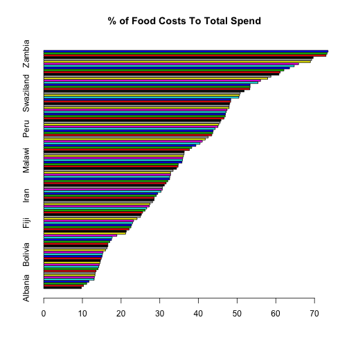

Coursera Course Pitch: Exploring Food Expenditures By Country
========================================================
author: mjurado
date: Sep 24, 2015
transition: zoom
font-family: 'Risque'

Summary
========================================================

This presentation is part of Coursera Developing
Data Products course project.  

The course project consists of two parts:

1. An interactive Shiny application
2. A pitch developed using RStudio Presenter or Slidify

About the Application
========================================================

This Shiny application compares the allocation of expenditures
among 114 countries for different food categories.

To use this application, select one of the radio buttons corresponding to a food category of interest to change the interactive map.  

You can __hover__ over the map to get detailed expenditure allocations for a given country.  The colors correspond to the degree of expenditures where red is the highest percentage and green is the lowest.

General instructions can also be found by selecting the __Instructions__ tab at the top of the [webpage](https://mjurado.shinyapps.io/Test_App).

The source code for this project can be located on [GitHub](https://github.com/juradom/Developing-Data-Products).

Data Details
========================================================
 

References
========================================================

The data for this Shiny application was obtained through the USDA and leverages the 1996 International Comparison Program (ICP) data.  

The source of the data can be found in a zip file called: [International Food Consumption Patterns](http://www.ers.usda.gov/data-products/international-food-consumption-patterns.aspx#26217).

